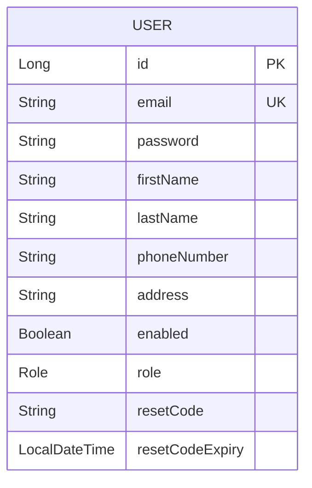
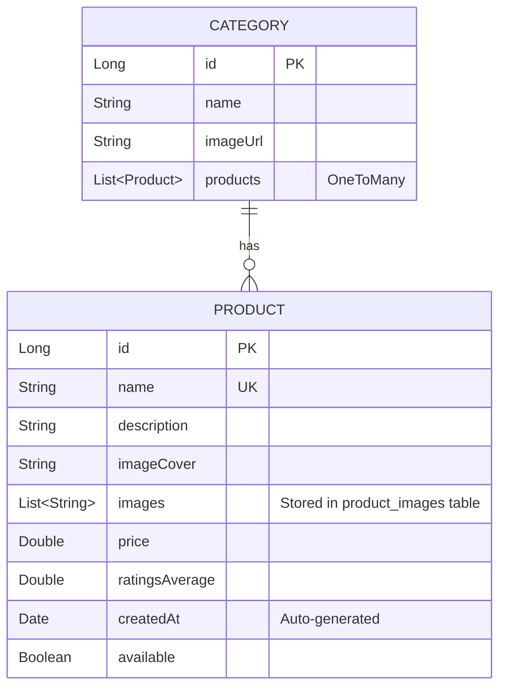
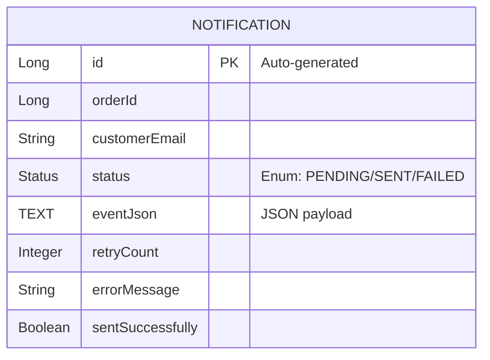

# 🛒 ShoppiaStore

[](https://github.com/ShoppiaStore) [](https://railway.app) [](LICENSE) [](https://github.com/ShoppiaStore)

Welcome to the official repository of **ShoppiaStore**, an e-commerce system built using a microservices architecture during our internship journey. The project covers every essential aspect of an online shopping platform, starting from user authentication to payments, product management, order handling, coupons, notifications, and user interfaces.

---

## 🧠 System Overview

Our platform consists of multiple decoupled services. Each service is responsible for a specific domain and communicates with others via REST APIs and event-driven messaging.

### Architecture Diagram
```
┌─────────────┐    ┌─────────────┐    ┌─────────────┐
│   Angular   │────│  API Gateway│────│ User Service│
│  Frontend   │    │   (Future)  │    │   (Auth)    │
└─────────────┘    └─────────────┘    └─────────────┘
                           │
        ┌──────────────────┼──────────────────┐
        │                  │                  │
┌─────────────┐    ┌─────────────┐    ┌─────────────┐
│   Catalog   │    │    Order    │    │   Coupon    │
│   Service   │    │   Service   │    │   Service   │
└─────────────┘    └─────────────┘    └─────────────┘
        │                  │                  │
        └──────────────────┼──────────────────┘
                           │
        ┌──────────────────┼──────────────────┐
        │                  │                  │
┌─────────────┐    ┌─────────────┐    ┌─────────────┐
│ Notification│    │    Bank     │    │    Store    │
│   Service   │    │   Service   │    │   Service   │
└─────────────┘    └─────────────┘    └─────────────┘
```

---

## 📦 Microservices

Below is a comprehensive list of all the systems/services included in the project:

| Service | Repository | Status | Tech Stack | Deployment |
|---------|------------|--------|------------|------------|
| 🔐 User API | [UserService](https://github.com/ShoppiaStore/UserService) | ✅ Active | Spring Boot, JWT, MySQL | [Live](https://userservice-production-f0da.up.railway.app) |
| 📦 Catalog API | [Catalog-Service](https://github.com/ShoppiaStore/Catalog-Service) | ✅ Active | Spring Boot, MySQL | [Live](https://catalogservice-production-9994.up.railway.app) |
| 🛒 Order Service | [Order-Service](https://github.com/ShoppiaStore/order-api) | ✅ Active | Spring Boot, PostgreSQL, RabbitMQ | [Live](https://order-api-production.up.railway.app) |
| 🎟️ Coupon Service | [Coupon-Service](https://github.com/ShoppiaStore/Coupon-Service) | ✅ Active | Spring Boot, PostgreSQL | [Live](https://coupon-api-production.up.railway.app) |
| 📬 Notification API | [NotificationService](https://github.com/ShoppiaStore/NotificationService) | ✅ Active | Spring Boot, RabbitMQ | [Live](https://notification-service-production.up.railway.app) |
| 🏦 Bank Service | [Bank-Service](https://github.com/ShoppiaStore/Bank-Service) | ✅ Active | Spring Boot, MySQL | [Live](https://bankingservice-production.up.railway.app) |
| 🏪 Store Service | [Store-Service](https://github.com/ShoppiaStore/Store-Service) | ✅ Active | Spring Boot, MySQL, RabbitMQ | [Live](https://store-service-production.up.railway.app) |

### 🔐 [User-Api](https://github.com/ShoppiaStore/UserService)

**Functionality:**
- **Manage Admin Users:** Provides functionality to add, activate, and deactivate admin users.
- **View List of Users:** Allows administrators to view a list of users for administrative purposes.

## 📈ERD 


**Implementation Notes:**
- Implements Spring Security's `UserDetails` interface
- Default security settings:
  - Account never expires
  - Account never locked
  - Credentials never expire
- Role field uses Enum values

### 📦 [Catalog-Api](https://github.com/ShoppiaStore/Catalog-Service)

**Functionality:**
- **Product Catalog:** Maintains a comprehensive catalog of products available for sale.
- **Product Information:** Stores detailed product information including descriptions, prices, and images.
- **Product Management:** Supports CRUD operations for managing products within the catalog.

## 📈ERD 


### 🛒 [Order-Service](https://github.com/ShoppiaStore/Order-Service)
Responsible for managing orders, their statuses, and order history.

### 🎟️ [Coupon-Service](https://github.com/ShoppiaStore/Coupon-Service)
Generates and validates discount coupons, supports expiration and usage limits.

### 📬 [Notification-Api](https://github.com/ShoppiaStore/NotificationService)
**Functionality:**
- **Notification Handling:** Sends notifications to users regarding order status updates, promotions, and other relevant information.
- **Event Listening:** Listens for events such as order placement, payment confirmation, and coupon redemption to trigger notifications.
 
## 📈ERD 


### 🏦 [Bank-Service](https://github.com/ShoppiaStore/Bank-Service)
Handles simulated payment operations and transaction records.

### 🏪 [Store-Service](https://github.com/ShoppiaStore/Store-Service)
Manages stores/warehouses and links products to store inventory.

---

## 💻 Frontend UIs

### 🛍️ [E-Commerce UI](https://github.com/ShoppiaStore/ShoppiaStore-UI)
The main user interface for customers to browse products, apply coupons, and place orders.
<p align="center">
  
  
  
</p>
<p align="center">
  
  
    
</p>

### 💳 [Bank UI](https://github.com/ShoppiaStore/Bank-UI)
A separate banking interface that simulates online payments securely.

---

## 🧩 Technologies Used

### Backend Technologies
- **Framework:** Java 17, Spring Boot 3.x
- **Security:** Spring Security, JWT Authentication
- **Database:** MySQL, PostgreSQL
- **Message Queue:** RabbitMQ
- **Migration:** Liquibase
- **Build Tool:** Maven

### Frontend Technologies
- **Framework:** Angular 15+
- **UI Components:** Angular Material
- **HTTP Client:** Angular HttpClient

### DevOps & Tools
- **Version Control:** Git, GitHub
- **Deployment:** Railway Cloud Platform
- **API Testing:** Postman
- **Database Design:** dbdiagram.io, draw.io
- **CI/CD:** GitHub Actions

---

## 🚀 Quick Start

### Prerequisites
- Java 17+
- Node.js 16+
- MySQL 8.0+
- Git

### Local Development Setup

1. **Clone the repositories:**
   ```bash
   git clone https://github.com/ShoppiaStore/UserService.git
   git clone https://github.com/ShoppiaStore/Catalog-Service.git
   git clone https://github.com/ShoppiaStore/order-api.git
   # ... clone other services
   ```

2. **Setup databases:**
   ```sql
   CREATE DATABASE shoppia_users;
   CREATE DATABASE shoppia_catalog;
   CREATE DATABASE shoppia_orders;
   ```

3. **Start services (each in separate terminal):**
   ```bash
   cd UserService && mvn spring-boot:run
   cd Catalog-Service && mvn spring-boot:run
   cd order-api && mvn spring-boot:run
   ```

4. **Start frontend:**
   ```bash
   cd ShoppiaStore-UI && npm install && ng serve
   ```

### Live Demo
- **🛍️ Customer Portal:** [ShoppiaStore UI](https://shoppia-store-ui.up.railway.app)
- **💳 Banking Portal:** [Bank UI](https://bank-ui.up.railway.app)

---

## 👨‍💻 Meet the Team

Our talented software engineering team made this project possible:

| Name | Photo | Role | GitHub Profile | Contributions |
|------|-------|------|----------------|---------------|
| **Esraa Refaat** |  | Software Engineer | [@IsraaRefaat](https://github.com/IsraaRefaat) | Order Service, Coupon Service |
| **Basma Mounir** |  | Software Engineer | [@BasmaMounir](https://github.com/BasmaMounir) | Catalog Service, Notification Service, User Service |
| **Shahd Mahmoud** |  | Software Engineer | [@Shahdd21](https://github.com/Shahdd21) | Store Service, Deployment |
| **Taghreed Ali** |  | Software Engineer | [@Taghreed-1225](https://github.com/Taghreed-1225) | Banking Service, Payment Processing |

---
## 🚀 Deployment

All services are deployed using [Railway](https://railway.app), allowing each microservice to run independently and scale as needed.

### Deployment Features
- **Auto-deployment** from GitHub
- **Environment management** for different stages
- **Monitoring & logs** for all services
- **Custom domains** for production URLs
- **Database hosting** with automatic backups

---

## 📄 License

This project is licensed under the MIT License - see the [LICENSE](LICENSE) file for details.

---

## 📞 Contact & Support

- **Project Issues:** Use GitHub Issues in respective repositories
- **Team Contact:** [Create an issue](https://github.com/ShoppiaStore/ShoppiaStore/issues) for general inquiries
- **Documentation:** Check individual repository READMEs for specific service documentation

---

<div align="center">
  <p>Made with ❤️ by the ShoppiaStore Software Engineering Team</p>
  <p>⭐ Star our repositories if you find this project helpful!</p>
  <p><strong>Thank you for visiting ShoppiaStore!</strong></p>
</div>
